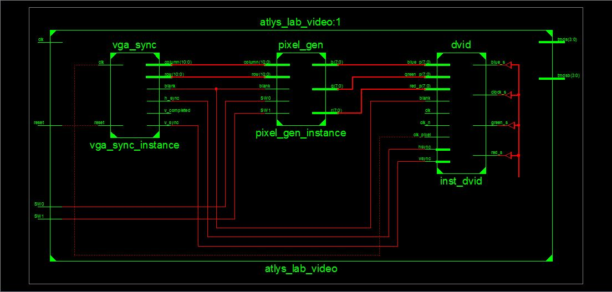
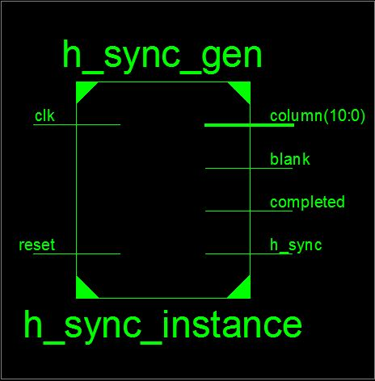
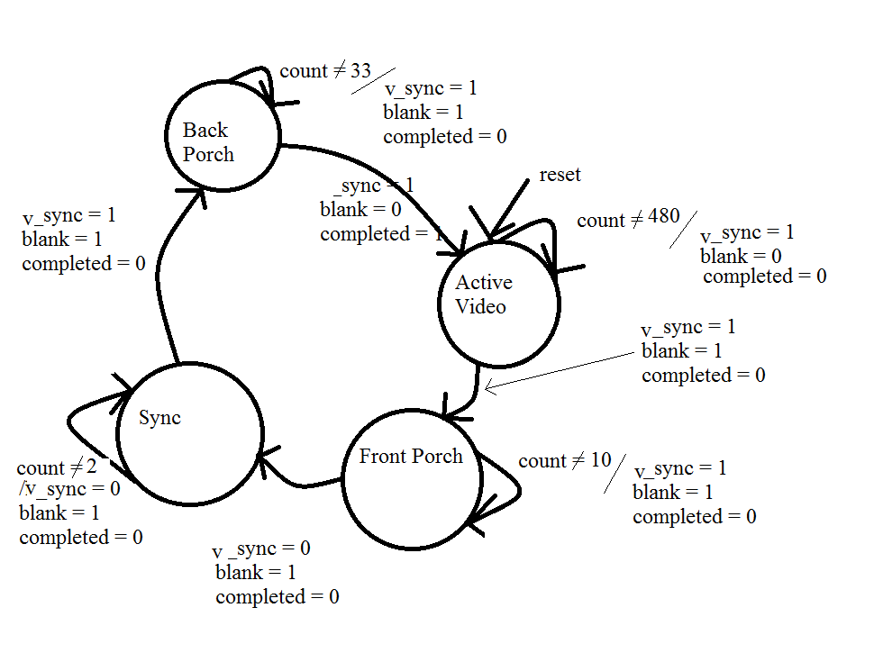
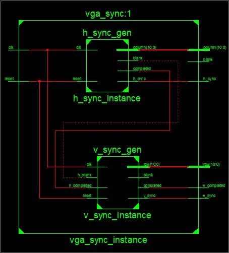

VGA_Controller
==============

Prelab
--------------
see prelab document in directory

Introduction
--------------
This lab is designed to create a VGA interface between our FPGA board through the HDMI out into a VGA monitor. For this lab, we used finite state machines to manipulate and send signals. These signals sync up with the monitor and allow us to transmit images to a display. 

Our problem was to inteface to a monitor over an HDMI to DVI cable using a VGA machine and some adaption code to change from VGA to HDMI. We had to come up with the H_SYNC, V_SYNC, VGA_SYNC, and PIXEL_GEN signals. Code was given to us in the top level but we had to interface all our components. 

Implementation
---------------

My top level component instantiation is a s follows:


This module basically consisted of wiring up the different components I previously created. 

The basis of the entire program was the H_SYNC_GEN signal. 


This component is based off the clock and times the pixel in the horizontal plain.

it uses flip-flops and a look-ahead buffer to do stuff. They look like this:
```vhdl
	--state reg
	process(clk, reset)
	begin
		if(reset ='1') then
			state_reg <= activeVid;
		elsif( rising_edge(clk)) then
			state_reg <= state_next;
		end if;
	end process;
	
	
	--output buf
	process(clk)
	begin
		if(rising_edge(clk)) then
			h_sync_reg <= h_sync_next;
			blank_reg <= blank_next;
			column_reg <= column_next;
			completed_reg <= completed_next;
		end if;
	end process;

```


the state diagram for this component is as follows:


my v_sync_gen sig follows the same format as my h_sync_gen sig. The major difference is it only increments its internal count when the h_complete signal has been asserted. the block diagram is as follows:


The state transition diagram is as follows:



Both my v_sync and h_sync combine together into my vga_sync which is as follows:



the vga_sync combines the blank signals of the v and h sync by the following logic:
```vhdl
	blank <= h_blank_sig or v_blank_sig;
```


Conclusion
---------------
This lab proved to be quite challenging given that I have not coded in VHDL for about a year and a half. The sheep dunking of VHDL bootcamp proved to be easy at the beginning, but there was no room to fall behind. If you did fall behind, it was almost impossible to get caught up because everything compiled on itself. This lab proved to be quite similar to the VHDL bootcamp because if you could not correctly create a testbench, you were for sure not able to debug your code. The other large issue I found with the lab was that the directions of what each individual signal were supposed to do was unclear at times. The big one was what the vga_sync blank signal was supposed to do. I had some convoluted process involving a whole slew of stuff when in fact the code only needed to be one line long. A larger clarification of the individual components would have been handy as well. It could easily be included in a comment block above the instantiation of the code in the top level. It could explain what the different signals are and how they are used. That would give a much greater understanding of the design goals and not leave us flowndering quite as much. 

Overall it was a rewarding experience to complete the design exercise. Getting a complete red screen on the monitor was an excelent way to end hours of frustration. I have a profound appreciation for people who do this for a living. Someday I might get on their level. probably not though...


