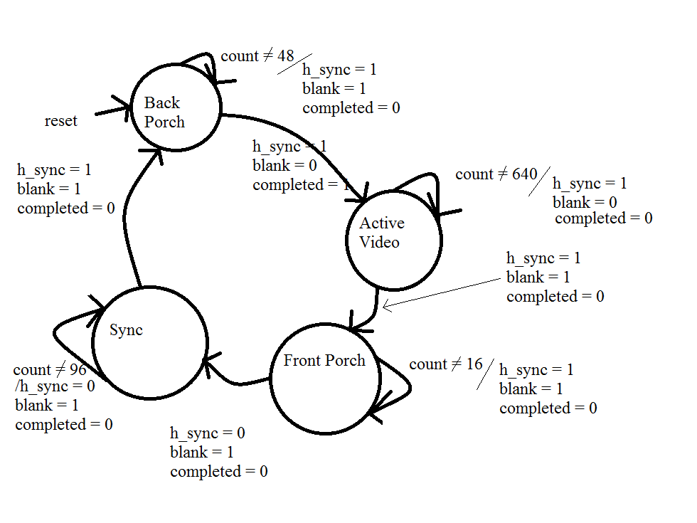
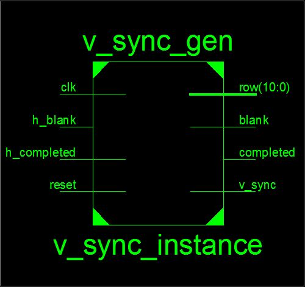

VGA_Controller
==============

Prelab
--------------
see prelab document in directory

Introduction
--------------
This lab is designed to create a VGA interface between our FPGA board through the HDMI out into a VGA monitor. For this lab, we used finite state machines to manipulate and send signals. These signals sync up with the monitor and allow us to transmit images to a display. 

Our problem was to inteface to a monitor over an HDMI to DVI cable using a VGA machine and some adaption code to change from VGA to HDMI. We had to come up with the H_SYNC, V_SYNC, VGA_SYNC, and PIXEL_GEN signals. Code was given to us in the top level but we had to interface all our components. 

Implementation
---------------

My top level component instantiation is a s follows:


This module basically consisted of wiring up the different components I previously created. 

The basis of the entire program was the H_SYNC_GEN signal. 


This component is based off the clock and times the pixel in the horizontal plain.

it uses flip-flops and a look-ahead buffer to do stuff. They look like this:
```vhdl
	--state reg
	process(clk, reset)
	begin
		if(reset ='1') then
			state_reg <= activeVid;
		elsif( rising_edge(clk)) then
			state_reg <= state_next;
		end if;
	end process;
	
	
	--output buf
	process(clk)
	begin
		if(rising_edge(clk)) then
			h_sync_reg <= h_sync_next;
			blank_reg <= blank_next;
			column_reg <= column_next;
			completed_reg <= completed_next;
		end if;
	end process;

```


the state diagram for this component is as follows:



my v_sync_gen sig follows the same format as my h_sync_gen sig. The major difference is it only increments its internal count when the h_complete signal has been asserted. the block diagram is as follows:


The state transition diagram is as follows:


Both my v_sync and h_sync combine together into my vga_sync which is as follows:


the vga_sync combines the blank signals of the v and h sync by the following logic:
```vhdl
	blank <= h_blank_sig or v_blank_sig;
```


Test and Debugging
-------------------
The largest issue I had with my code was not including my constraints file. Aparently that thing is pretty important. it looks sort of like this:

```vhdl
VCCAUX = 3.3;

NET "clk" LOC = "L15" | PERIOD = 100 MHz;

NET "reset" LOC = "F5" | IOSTANDARD = LVCMOS33;

NET "SW0" LOC = "A10" | IOSTANDARD = LVCMOS33;
NET "SW1" LOC = "D14" | IOSTANDARD = LVCMOS33;

NET "TMDS(0)"      LOC = "D8" | IOSTANDARD = TMDS_33 ; # Blue
NET "TMDSB(0)"  LOC = "C8" | IOSTANDARD = TMDS_33 ;
NET "TMDS(1)"      LOC = "C7" | IOSTANDARD = TMDS_33 ; # Red
NET "TMDSB(1)"  LOC = "A7" | IOSTANDARD = TMDS_33 ;
NET "TMDS(2)"      LOC = "B8" | IOSTANDARD = TMDS_33 ; # Green
NET "TMDSB(2)"  LOC = "A8" | IOSTANDARD = TMDS_33 ;
NET "TMDS(3)"      LOC = "B6" | IOSTANDARD = TMDS_33 ; # Clock
NET "TMDSB(3)"  LOC = "A6" | IOSTANDARD = TMDS_33 ;
```

Once this puppy was included, things started moving in places and directions that I wanted them to move!

Another issue I had was in my v_sync_gen code. for my 480th case, it would only stay on it for about 1 clock cycle, then it would automatically switch. The work around to this was not only incrementing the count only when h_complete was asserted, but also to only switch states when h_complete was asserted. After that quick little blip of a code, my 480th case worked like a charm. 

Another issue that I did not realize I had was my vga_blank signal. I had some convoluted dealio that only asserted when the wrong condition was present. After talking with Kevin Cooper, I was able to better understand what that signal was doing, and as such, I was able to fix it accordingly. 

to test my code, I used test benches. I was able to have xilinx automatically generate the testbench. Once I did that, I could create assert conditions that owuld automatically tell me if things were broken. I didn't really do this approach. Instead, I just looked at the waveforms at the transitions to see if things were linining up and asserting and deserting when I thought they should be. I was able to verify my H_sync signal quite easily because it was based off the clock. I was unable to test the v_sync signal by itself because it required the h_sync signal. Instead, I created a testbench for the vga_sync signal which included both signals. Testhing that signal was easy because it had the h_sync which was based off the clock already running into the v_sync which needed the h_sync. This proved to be a much easier way to verify everything because I could look at both components simultaniously. The hard part of this technique was that my signal was quite long. it was about 2.4ms just to get 1 complete frame to simulate. Heaven forbid I wanted to test two frame, that would be like twice as long!


Conclusion
---------------
This lab proved to be quite challenging given that I have not coded in VHDL for about a year and a half. The sheep dunking of VHDL bootcamp proved to be easy at the beginning, but there was no room to fall behind. If you did fall behind, it was almost impossible to get caught up because everything compiled on itself. This lab proved to be quite similar to the VHDL bootcamp because if you could not correctly create a testbench, you were for sure not able to debug your code. The other large issue I found with the lab was that the directions of what each individual signal were supposed to do was unclear at times. The big one was what the vga_sync blank signal was supposed to do. I had some convoluted process involving a whole slew of stuff when in fact the code only needed to be one line long. A larger clarification of the individual components would have been handy as well. It could easily be included in a comment block above the instantiation of the code in the top level. It could explain what the different signals are and how they are used. That would give a much greater understanding of the design goals and not leave us flowndering quite as much. 

Overall it was a rewarding experience to complete the design exercise. Getting a complete red screen on the monitor was an excelent way to end hours of frustration. I have a profound appreciation for people who do this for a living. Someday I might get on their level. probably not though...

Legal
=========
Use my code to your hearts content. Please just document me. You would be better off doing this on a MSP because it is a problem that a lot of people have already solved and solved it better than I have. Also, an MSP is a heck of a lot cheaper than an FPGA


